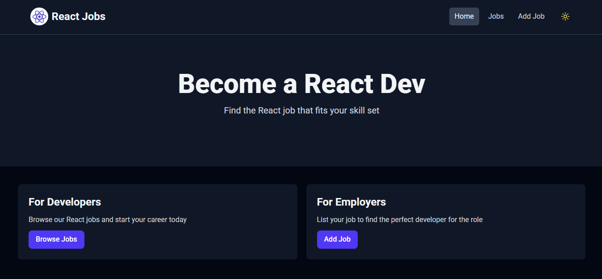

# React Jobs - Job Listing App

A modern job listing application built with **React**, **Tailwind CSS**, and **MirageJS**.  
This app allows users to view, add, update, and manage job listings with a smooth user experience, including dark mode support.

## 🚀 Features
- View all job listings
- Add new job postings
- Update existing job listings
- Responsive design (mobile, tablet, desktop)
- Dark mode with persistence (saved in localStorage)
- Loading spinners for async actions
- Clean and modern UI
- **Mock API powered by MirageJS** (no backend required)

## 🛠️ Tech Stack
- **React** (frontend framework)
- **Tailwind CSS** (styling)
- **React Router** (navigation)
- **MirageJS** (mock API for job data)
- **LocalStorage** (theme persistence)

## 📸 Screenshots
Light Mode | Dark Mode
:-------------------------:|:-------------------------:
 | 


## 🔧 Installation & Setup
1. Clone the repository:
   ```bash
   git clone https://github.com/diddy0077/react-jobs.git
   ```
2. Navigate into the project folder:
   ```bash
   cd job-listing
   ```
3. Install dependencies:
   ```bash
   npm install
   ```
4. Start the development server:
   ```bash
   npm start
   ```

## 🌍 Live Demo
[Deployed App](https://reactjob-listing.netlify.app/)

## 📜 License
This project is open source and available under the [MIT License](LICENSE).

---

💡 *Built with passion to showcase frontend skills and create a professional portfolio project.*
